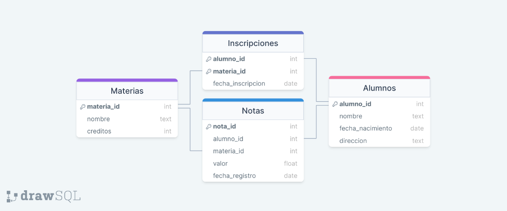
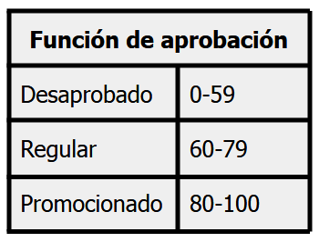

# Challenge MySQL - posición Data Engineer SR/Ssr

### Descripción del negocio

"CoreBI School" es una entidad ficticia que será utilizada para evaluar la práctica en SQL.
Como toda intitución educativa, la entidad está conformada por alumnos, docentes y equipo directivo. A fines de realizar este challenge se abstraerá una porción del negocio, conformando las siguientes entidades o tablas:

* Alumnos: Contiene información de los estudiantes y su legajo como clave primaria.
* Materias: Contiene la información de las distintas asignaturas.
* Inscripciones: Contiene la información de las inscripciones realizadas por los alumnos de las materias.
* Notas: Contiene la información de las notas obtenidas en los exámenes por un alumno en una materia. Cada nota tiene un identificador único.

