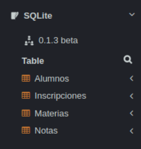

# Challenge MySQL - posición Data Engineer SR/Ssr

### Descripción del negocio
---------------------------

"CoreBI School" es una entidad ficticia que será utilizada para evaluar la práctica en SQL.
Como toda intitución educativa, la entidad está conformada por alumnos, docentes y equipo directivo. A fines de realizar este challenge se abstraerá una porción del negocio, conformando las siguientes entidades o tablas:

* Alumnos: Contiene información de los estudiantes y su legajo como clave primaria.
* Materias: Contiene la información de las distintas asignaturas.
* Inscripciones: Contiene la información de las inscripciones realizadas por los alumnos de las materias.
* Notas: Contiene la información de las notas obtenidas en los exámenes por un alumno en una materia. Cada nota tiene un identificador único.
            
<table>
  <tr>
    <th colspan="2">Función de aprobación</th>
  </tr>
  <tr>
    <td>Desaprobado</td>
    <td>0-59</td>
  </tr>
  <tr>
    <td>Regular</td>
    <td>60-79</td>
  </tr>
    <tr>
    <td>Promocionado</td>
    <td>80-100</td>
  </tr>
</table>

### Instrucciones previas al desarrollo de las consignas
--------------------------------------------------------

Para llevar a cabo el challenge es necesario preparar el ambiente de trabajo. Para ello, se deberán seguir las siguientes instrucciones:

1. Ingrese al enslace [https://sqliteonline.com/](https://sqliteonline.com/)
2. Presione el botón "import" ubicado en la parte superior.
3. Importe el archivo "challenge.sql" incluido en las carpetas del challenge
4. Debería poder visualizar las tablas creadas en el panel de la izquierda como se muestra a continuación:

5. Ya está listo para realizar el challenge. En el bloque de código podrá ejecutar las consultas para resolver cada punto del mismo.

IMPORTANTE: Recuerde que debe entregat las consultas SQL elaboradas en un documento.

### Criterios a evaluar
----------------------

En cada consigna deberá proporcionar la consulta SQL que satisfaga cada enunciado. Para obtenerla, podrá utilizar el motor de la página web proporcionada.
En cada solución se evaluarán los siguientes aspectos:
* Efectividad (resultados correctos).
* Complejidad (debe mantenerse al mínimo posible)

### Consignas
-------------

1. El equipo docente de la asignatura Historia sostiene que hay una gran cantidad de alumnos promocionados en su materia nacidos desde 1998 en adelante. Se desea obtener su id, nombre y fecha de nacimiento.

2. La asignatura de Matemáticas es una de las más exigentes según las encuestas estudiantiles. Para conocer el estado histórico de los exámenes de fin de curso en esta materia se desea obtener una tabla que contenga las columnas ‘Desaprobados’, ‘Regulares’, ‘Promocionados’, ‘Total’. Debe contener una sola fila con la cantidad de alumnos correspondiente a cada columna.

3. A fin de priorizar la asignación de recursos educativos entre las materias, se desea obtener el listado de id de aquellas materias que tengan más de 5 alumnos inscriptos antes del año 2022.

4. El equipo directivo de Corebi School desea conocer la variación generacional en los estudiantes inscritos. Para ello es necesario obtener el listado de la cantidad de alumnos registrados por cada generación (año de nacimiento) ordenados por año descendentemente.

5. Para obtener la “Beca de investigación en ciencias naturales” es necesario cumplir con 10 omás créditos en los exámenes del año correspondiente. Para ganar los créditos de una materia es necesario como mínimo regularizarla. Se desea conocer el nombre y cantidad de créditos de los alumnos ganadores de la beca en el año 2021.

