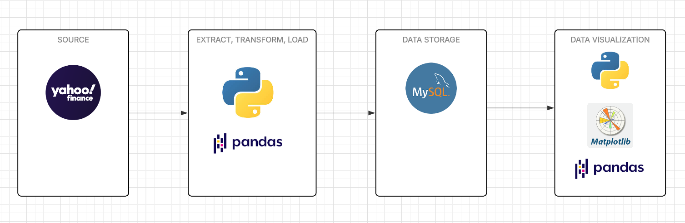
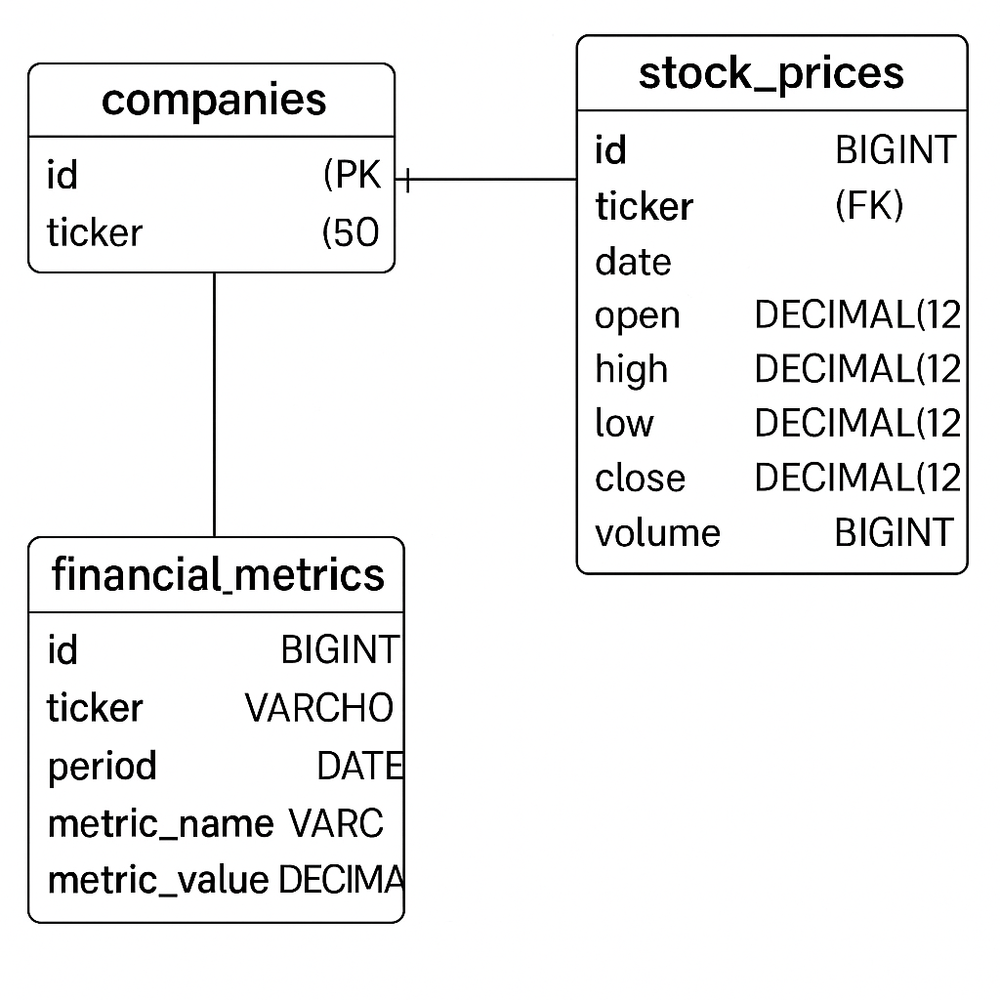

# Desarrollo de Pipeline ETL Financiero con Almacenamiento y Análisis en MySQL

## Descripción general del proyecto

El objetivo principal de este proyecto fue el diseño e implementación de un pipeline de ETL (Extract, Transform, Load) enfocado en datos financieros de empresas, específicamente precios históricos de acciones y métricas clave de desempeño.

La fase de Extracción (Extract) se realizó utilizando Python, a través de bibliotecas especializadas que permitieron acceder a fuentes de datos externas y APIs de mercado bursátil. Esta etapa incluyó la conexión directa con bases de datos y la recolección automatizada de precios diarios de acciones y reportes financieros relevantes.

Durante la fase de Transformación (Transform), los datos sin procesar fueron limpiados, normalizados y reorganizados para garantizar su integridad y coherencia. Se aplicaron procesos como manejo de valores nulos, conversión de tipos de datos, ajustes de formatos de fechas y unificación de métricas financieras para su posterior análisis.

En la etapa de Carga (Load), los datos transformados fueron insertados eficientemente en una base de datos relacional MySQL, diseñada bajo un modelo lógico normalizado, con tablas específicas para compañías, precios históricos y métricas financieras. Se implementaron índices, claves foráneas y restricciones de unicidad para asegurar la calidad del almacenamiento.

Complementariamente, se crearon vistas analíticas en SQL que facilitan consultas posteriores para responder preguntas de negocio relevantes, tales como la identificación de empresas más volátiles, mayores crecimientos de precios o caídas abruptas de mercado. Estas vistas también optimizan el rendimiento para análisis exploratorios rápidos.

Finalmente, mediante Python y Matplotlib, se realizaron **visualizaciones automatizadas** de insights financieros extraídos del sistema, habilitando una capa gráfica inicial para la interpretación de datos.

Este pipeline de ETL proporciona una base sólida para desarrollos futuros en áreas como benchmarking de empresas, análisis de tendencias del mercado, modelado predictivo y aplicaciones de ciencia de datos financieras.

## Diagrama de arquitectura

## Diagrama ER relacional – Base de datos financiera

## Enfoque personal y posibles mejoras

Mi enfoque personal consistió en el armado de un pipeline básico pero funcional, poniendo énfasis en el control de calidad de los datos para producir métricas confiables. Es por este motivo que utilice un enfoque de modelado de datos relacional (SQL) para garantizar la calidad y confiabilidad de los mismos.
Las posibles mejoras que tiene este desarrollo son diversas, en cuanto a la extracción automatizada se podría implementar Airflow o Nifi para gestionar la ejecución diaria del script. Respecto a la base de datos y para garantizar la escalabilidad del almacenamiento se puede continuar optimizando las tablas y adicionando índices, además, podría considerarse la idea de utilizar otro motor de bases de datos como Teradata si el caudal de información es lo suficientemente alto.
Por último, para aprovechar al máximo la visualización y el monitoreo de datos pueden utilizarse herramientas un tanto mas sofisticadas como Power BI, Tableau, Looker o Grafana, todas ellas ofrecen conectores e integraciones con Bases de datos SQL y NoSQL.
